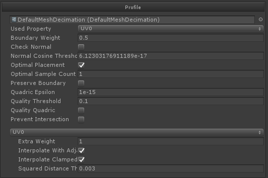

# UnityMeshDecimation

[Unity](https://unity.com/)模型網格縮減

演算法源自[vcglib tridecimator](https://github.com/cnr-isti-vclab/vcglib/tree/master/apps/tridecimator)，但針對Unity網格重新撰寫並增加其他功能。


Charizard © Pokémon Ltd

## 相容性

目前僅測試過以下版本，但也可能兼容其他版本

| 版本
|------
| Unity 2018.4.x
| Unity 2020.3.x

## 使用方法

使用本專案或複製`Assets/UnityMeshDecimation`到你的專案

### 圖形介面

從選單`Window/Unity Mesh Decimation`開啟工具

+ 輸入模型

    

+ 終止條件

    

+ 邊緣合併參數

    

+ 輸出位置

    

### 腳本

```csharp
using UnityMeshDecimation;

// 終止條件
var conditions= new TargetConditions();
conditions.faceCount = 1000;

// 邊緣合併參數
var parameter = new EdgeCollapseParameter();
parameter.UsedProperty = VertexProperty.UV0;

var meshDecimation = new UnityMeshDecimation();
meshDecimation.Execute(inputMesh, parameter, conditions);

var outputMesh = meshDecimation.ToMesh();
```

## 額外權重

除了添加頂點屬性進Quadrics計算中外，還可以針對屬性交接處給予額外權重來盡量避免移動。

例如同個頂點在相鄰不同面有不同貼圖座標(屬於交接處)

```csharp
var parameter = new EdgeCollapseParameter();
parameter.UsedProperty = VertexProperty.UV0;

var property = parameter.GetPropertySetting(VertexProperty.UV0);
property.ExtraWeight = 1;

// 預設屬性計算為自身，但可以自定義，
// 例如計算貼圖座標是以取樣的貼圖顏色為基準。
// property.SampleFunc = (Vector4 value) => {
//    return value;
// };
```

<table>
    <tr>
        <td>位置</td>
        <td>位置, 貼圖座標</td>
        <td>位置, 貼圖座標, 額外權重</td>
    </tr>
    <tr>
        <td></td>
        <td></td>
        <td></td>
    </tr>
</table>

## 範例

+ Lucy © Stanford University

<table>
    <tr>
        <td>99970面<br>(原始)</td>
        <td></td>
        <td></td>
    </tr>
    <tr>
        <td>50000面<br>(50%)</td>
        <td></td>
        <td></td>
    </tr>
    <tr>
        <td>10000面<br>(10%)</td>
        <td></td>
        <td></td>
    </tr>
</table>

+ Robot © Unity Technologies

<table>
    <tr>
        <td>6132面<br>(原始)</td>
        <td></td>
        <td></td>
    </tr>
    <tr>
        <td>3000面<br>(50%)</td>
        <td></td>
        <td></td>
    </tr>
    <tr>
        <td>600面<br>(10%)</td>
        <td></td>
        <td></td>
    </tr>
</table>

## 品質關聯

最終品質與模型屬性多寡有關，只帶有座標是最簡單的，縮減過程只考慮形狀就行，

但相對的帶有越多屬性要同時考慮就會讓計算更複雜，也越難達到好的品質。

例如Arc System Works的[卡通渲染方法](https://www.youtube.com/watch?v=yhGjCzxJV3E)，顏色區塊依賴頂點座標的位置，只要稍微移動，就會造成嚴重視覺瑕疵。

+ Narmaya © Cygames, Inc

<table>
    <tr>
        <td>87753面<br>(原始)</td>
        <td></td>
        <td></td>
    </tr>
    <tr>
        <td>48909面<br>(55%)</td>
        <td></td>
        <td></td>
    </tr>
</table>
